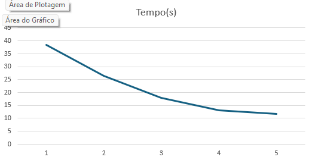
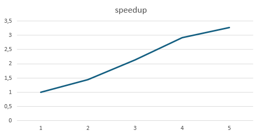
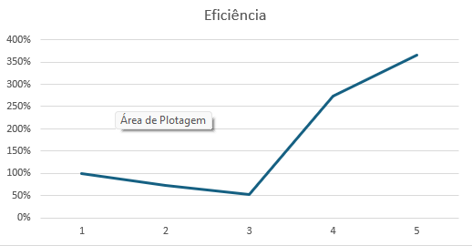

# Relatório de Atividade: Análise de Similaridade de Perguntas com MPI

**Disciplina:** Programação Paralela e Distribuída  
**Aluno(s):** Yan Lemos  
**Turma:** ADS 5° Semestre  
**Professor:** Rafael  
**Data:** 10/04/2026  

---

# 1. Descrição do Problema

O programa resolve o problema de identificação de redundância em bases de dados textuais, comparando perguntas para encontrar similaridades semânticas ou duplicatas exatas.

* **Problema implementado:** Comparação pareada de strings em larga escala.  
* **Algoritmo utilizado:** Cálculo de similaridade textual (All-to-All) distribuído via passagem de mensagens.  
* **Tamanho da entrada:** 4.999 perguntas, resultando em **12.492.501 comparações**.  
* **Objetivo da paralelização:** Reduzir o tempo de processamento de uma tarefa de complexidade quadrática $O(N^2)$, distribuindo os índices de comparação entre diferentes processos independentes.

---

# 2. Ambiente Experimental

| Item                        | Descrição                  |
| --------------------------- | -------------------------- |
| Processador                 | Intel Core i7-13000H       |
| Número de núcleos           | 7 Cores / 12 Threads       |
| Memória RAM                 | 16GB DDR4                  |
| Sistema Operacional         | Windows 11                 |
| Linguagem utilizada         | Python                     |
| Biblioteca de paralelização | MPI4Py                     |
| Ambiente de execução        | VSCode                     |

---

# 3. Metodologia de Testes

* **Medição de tempo:** Utilizado `time.time()` para capturar o tempo total de execução.  
* **Execuções:** Foram realizados testes variando o número de processos MPI.  
* **Objetivo:** Avaliar desempenho, speedup e eficiência do paralelismo.

---

# 4. Resultados Experimentais

| Nº Threads/Processos | Tempo de Execução (s) |
| -------------------- | --------------------- |
| 1                    | 38.39                 |
| 2                    | 26.44                 |
| 4                    | 18.03                 |
| 8                    | 13.15                 |
| 12                   | 11.72                 |

---

# 6. Tabela de Resultados (Speedup e Eficiência)

| Threads/Processos | Tempo (s) | Speedup | Eficiência |
| ----------------- | --------- | ------- | ---------- |
| 1                 | 38.39     | 1.00    | 100%       |
| 2                 | 26.44     | 1.45    | 73%        |
| 4                 | 18.03     | 2.13    | 53%        |
| 8                 | 13.15     | 2.92    | 36%        |
| 12                | 11.72     | 3.28    | 27%        |

---

# 7. Gráfico de Tempo de Execução

---

# 8. Gráfico de Speedup

---

# 9. Gráfico de Eficiência

---

# 10. Análise dos Resultados

* **Escalabilidade:** A aplicação apresenta ganho de desempenho com o aumento do número de processos, porém com crescimento **sublinear**.

* **Eficiência:** Há uma queda progressiva da eficiência:
  - 2 processos → 73%
  - 4 processos → 53%
  - 8 processos → 36%
  - 12 processos → 27%

* **Gargalos identificados:**
  - Sobrecarga de comunicação MPI (`gather`)
  - Desbalanceamento de carga entre processos
  - Overhead de criação e gerenciamento de processos
  - Limitação de hardware (threads lógicas vs núcleos físicos)

* **Observação importante:**  
  O ganho de desempenho reduz conforme aumenta o número de processos. De 8 para 12 processos, a redução de tempo é pequena (~1.4s), indicando saturação do paralelismo.

---

# 11. Conclusão

A paralelização com MPI reduziu significativamente o tempo de execução de **38.39s para 11.72s**, demonstrando a eficácia do uso de múltiplos processos.

Entretanto, o speedup não é linear e a eficiência diminui conforme aumentam os processos. O melhor equilíbrio entre desempenho e eficiência ocorre entre **2 e 4 processos**.

Para melhorias futuras, recomenda-se:

* Melhorar o balanceamento de carga
* Reduzir o volume de dados coletados no `gather`
* Explorar paralelismo híbrido (MPI + threads)
* Avaliar uso de mais núcleos físicos

---
